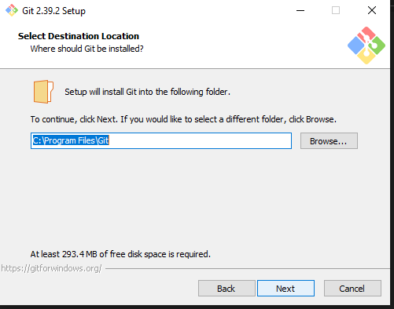
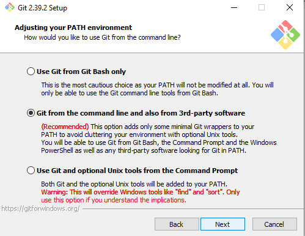

# installasi Git
1. Setelah download Git, double click pada file yang di-download. Akan dimunculkan lisensi. Klik Next untuk lanjut.

2. Setelah itu, pilih lokasi instalasi. Secara default akan terisi C:\Program Files\Git. Ganti lokasi jika memang anda menginginkan lokasi lain, klik Next

3.Pilih komponen. Tidak perlu diubah-ubah, sesuai dengan default saja. Klik pada Next.

4.Mengisi shortcut untuk menu Start. Gunakan default (Git), ganti jika ingin mengganti - misalnya Git VCS.

5.Pilih editor yang akan digunakan bersama dengan Git. Pada pilihan ini, digunakan VS Code.

6.Pada saat instalasi, Git menyediakan akses git melalui Bash maupun command prompt. Pilih pilihan kedua supaya bisa menggunakan dari dua antarmuka tersebut. 
Bash adalah shell di Linux. Dengan menggunakan bash di Windows, pekerjaan di command line Windows bisa dilakukan menggunakan bash - termasuk ekskusi dari Git.

7.Pilih OpenSSL untuk HTTPS. Git menggunakan https untuk akes ke repo GitHub atau repo-repo lain (GitLab, Assembla).

8.Pilih pilihan pertama untuk konversi akhir baris (CR-LF).

9.Pilih PuTTY untuk terminal yang digunakan untuk mengakses Git Bash.

10.Untuk opsi ekstra, pilih serta aktifkan 1 dan 2.

11.setelah itu proses instalasi akan dilakukan.

12.Jika selesai akan muncul dialog pemberitahuan. Klik pada Finish.

13.Untuk menjalankan, dari Start menu, ketikkan "Git", akan muncul beberapa pilihan. Pilih "Git Bash" atau "Git GUI".

14.Tampilan jika akan menggunakan "Git Bash"

